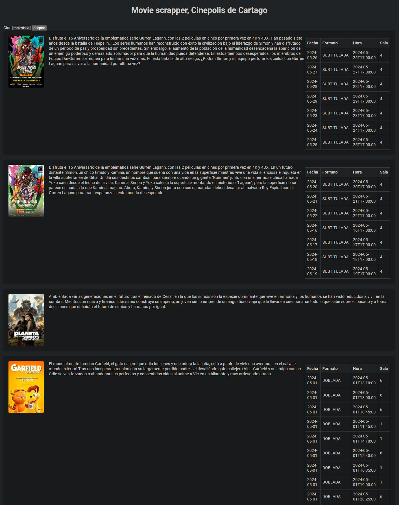

# Movie Scrapper View

`movie_scrapper_view` is a web view developed in Django that serves as a frontend interface for the Movie Scrapper application. It connects to a backend called `Movie Scrapper` to display and manage data related to movies.

## Demo:


## Features:

1. **Intuitive Web Interface:** Provides a user-friendly interface to explore and manage information from the backend.

2. **Backend Connection:** `movie_scrapper_view` connects efficiently to the `Movie Scrapper` backend, retrieving movie data in real-time or from a local database.

3. **Data Visualization:** Displays detailed information about movies, including titles, genres, synopses, ratings, and more.

4. **Search:** Users can search different cinemas.


## Installation:

1. Clone the repository:
   ```bash
    git clone https://github.com/TheRealSlimTony/movie_scrapper_view

2. Clone the repository:
   ```bash
    pip install -r requirements.txt

3. Python Manage.py runserver
  ```bash
    python manage.py runserver


